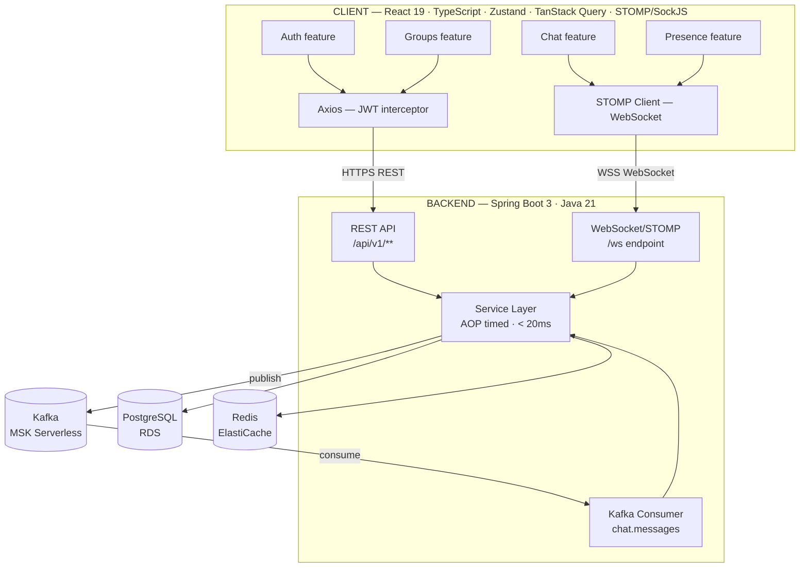
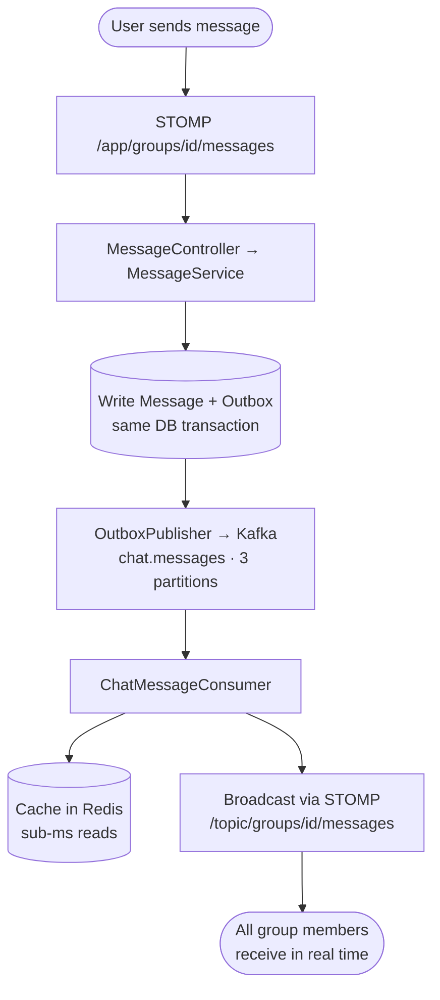
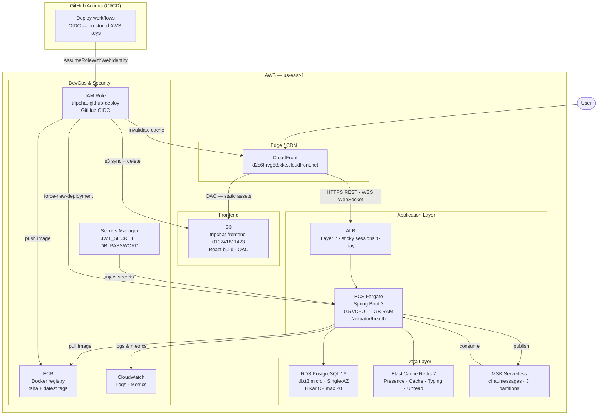
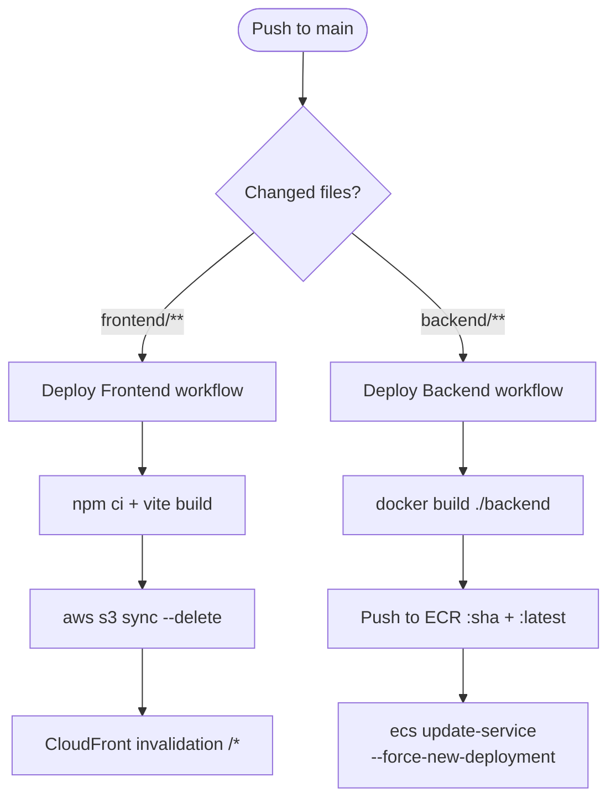

# TripChat

A real-time group chat application built for travelers to communicate and coordinate. Supports 1000+ daily active users with sub-100ms message delivery.

**Live App:** https://d2c6hrvg5t8xkc.cloudfront.net

---

## Features

- **Authentication** — Register / login with JWT tokens (24h TTL)
- **Group Management** — Create groups, join via 8-character invite codes, leave groups, regenerate invite codes (admin)
- **Real-time Messaging** — WebSocket + STOMP protocol with SockJS fallback
- **Typing Indicators** — See who is typing in real time
- **Presence Tracking** — Online/offline status with 20s heartbeat (30s Redis TTL)
- **Unread Counts** — Per-group unread message counters
- **Infinite Scroll** — Cursor-based message pagination (no offset, more efficient)
- **Optimistic UI** — Messages appear instantly with clientId deduplication
- **Message Deletion** — Senders can delete their own messages
- **Kafka Durability** — Outbox pattern ensures no message loss on failure

---

## System Design



### Message Flow



### Latency Targets

| Operation               | Target  |
|-------------------------|---------|
| Server-side processing  | < 20ms  |
| Send → all receive      | < 100ms |
| Message load (cache hit)| < 1ms   |
| Message load (cache miss)| < 15ms  |

---

## Tech Stack

### Frontend
| Layer | Technology |
|---|---|
| Framework | React 19 + TypeScript |
| Build | Vite 7 |
| Routing | React Router v7 |
| State | Zustand 5 |
| Server State | TanStack Query v5 |
| HTTP | Axios (JWT interceptor + 401 logout) |
| WebSocket | STOMP.js + SockJS |
| Forms | React Hook Form + Zod |
| Styling | Tailwind CSS v4 |
| Testing | Vitest + Playwright + MSW |

### Backend
| Layer | Technology |
|---|---|
| Language | Java 21 |
| Framework | Spring Boot 3.4 |
| Database | PostgreSQL 16 (Spring Data JPA + HikariCP) |
| Cache | Redis 7 (Lettuce, non-blocking) |
| Messaging | Apache Kafka 3 (Outbox pattern, manual ack) |
| WebSocket | Spring WebSocket + STOMP |
| Auth | Spring Security 6 + JWT (jjwt 0.12) |
| Observability | Spring AOP (execution timing) + Actuator |
| Testing | JUnit 5 + Mockito + AssertJ |

---

## AWS Architecture



### CI/CD Pipeline



Authentication uses GitHub OIDC (no long-lived AWS keys stored in secrets).

---

## API Reference

### REST Endpoints

| Method | Endpoint | Description |
|--------|----------|-------------|
| `POST` | `/api/v1/auth/register` | Register new user |
| `POST` | `/api/v1/auth/login` | Login, returns JWT |
| `GET` | `/api/v1/groups` | List user's groups |
| `POST` | `/api/v1/groups` | Create group |
| `POST` | `/api/v1/groups/join` | Join via invite code |
| `POST` | `/api/v1/groups/{id}/leave` | Leave group |
| `POST` | `/api/v1/groups/{id}/invite-code` | Regenerate invite code (admin) |
| `GET` | `/api/v1/groups/{id}/messages?cursor=&limit=20` | Paginated message history |
| `DELETE` | `/api/v1/messages/{id}` | Delete message (sender only) |
| `GET` | `/api/v1/groups/{id}/presence` | Online members in group |

### WebSocket (STOMP)

Connect to `/ws` with JWT in STOMP CONNECT frame.

| Direction | Destination | Description |
|-----------|-------------|-------------|
| Subscribe | `/topic/groups/{id}/messages` | Receive group messages |
| Subscribe | `/topic/groups/{id}/typing` | Typing indicators |
| Subscribe | `/topic/groups/{id}/presence` | Online/offline events |
| Subscribe | `/user/queue/notifications` | Personal notifications |
| Send | `/app/groups/{id}/messages` | Send a message |
| Send | `/app/groups/{id}/typing` | Send typing event |
| Send | `/app/presence/heartbeat` | Keep-alive (every 20s) |

---

## Local Development

### Prerequisites
- Docker + Docker Compose
- Java 21
- Node.js 20+

### Setup

```bash
git clone https://github.com/amitpatle10/TripChat.git
cd TripChat
cp .env.example .env    # fill in JWT_SECRET (64-char hex)
docker compose up -d    # starts postgres, redis, kafka, backend, frontend
```

App runs at `http://localhost:5173` (frontend) and `http://localhost:8080` (backend).

### Run individually

```bash
# Backend
cd backend && ./mvnw spring-boot:run -Dspring-boot.run.profiles=dev

# Frontend
cd frontend && npm install && npm run dev
```

### Tests

```bash
# Backend
cd backend && ./mvnw test

# Frontend unit tests
cd frontend && npm test

# Frontend E2E
cd frontend && npm run test:e2e
```

---

## Cost Estimate

~$70–100/month at 1000 DAUs (ECS Fargate + RDS t3.micro + ElastiCache + MSK Serverless + CloudFront)
